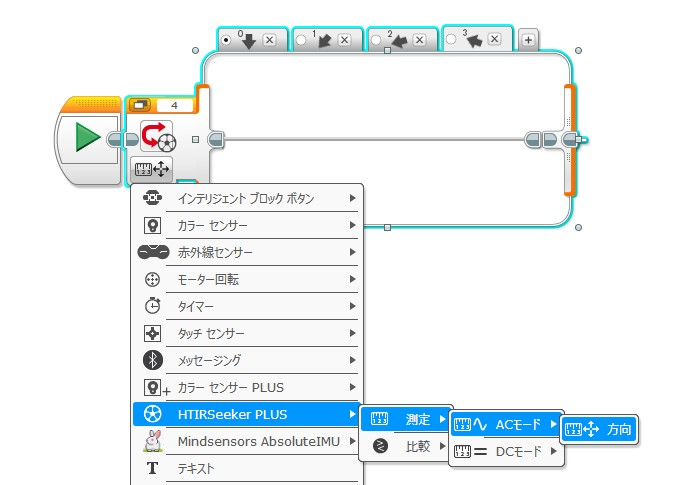

# HT IRSeeker PLUS
## 概要 (Overview)
**HT IRSeeker PLUS** は、LEGO MINDSTORMS EV3 向けの拡張プログラミングブロックです。従来の IRSeeker で取得できる「**方向**」や「**強さ（明るさ）**」に加え、本ブロックではスイッチブロックやループブロックで利用可能な**比較モード**や**選択モード**も搭載しています。

**HT IRSeeker PLUS** is an extended programming block for LEGO MINDSTORMS EV3.
In addition to measuring **direction** and signal **strength (brightness)** like the original IRSeeker,
this block also supports **comparison** and **selection** modes that can be used in Switch and Loop blocks.

本ブロックでは、以下の4つのモードが使用できます。

This block provides the following four modes.

---
### 方向 AC/DC 測定モード (Measure AC/DC Direction Mode)
赤外線信号の**方向**を測定します。
RCJサッカーの赤外線ボール（Aモード / Bモード）の信号方向を取得可能です。

Measures the **direction** of the infrared (IR) signal.
It can detect the direction of the IR ball used in RoboCup Junior Soccer (A-mode / B-mode).

---
### 明るさ AC/DC 測定モード (Measure AC/DC Strength Mode)
赤外線信号の**強さ（明るさ）** を測定します。
ボールとの距離を確認する際に利用できます。

Measures the **strength (intensity)** of the infrared signal.
Useful for estimating the distance to the IR ball.

---
### 方向 選択モード (Select AC/DC Direction Mode)
スイッチブロックで使用可能な**方向選択モード**です。
「HTIRSeekerPLUS」→「測定」→「AC/DCモード」→「方向」を選択すると利用できます。

This is a **direction selection mode** for use with the Switch Block.
Select “HTIRSeekerPLUS” → “Measure” → “AC/DC Mode” → “Direction” to access this mode.

---
### 明るさ AC/DC 比較モード (Measure AC/DC Strength Mode)
検出した赤外線の**明るさ**を、設定した閾値および**比較演算子**を用いて判定します。結果は「真（TRUE）」または「偽（FALSE）」として出力され、スイッチ、ループ、待機ブロックからも使用できます。

Compares the detected infrared **strength** with a user-defined threshold using a **comparison operator**.
The result is returned as TRUE or FALSE, and can also be used in Switch, Loop, and Wait blocks.

## インストール方法
- [Releases ページ](https://github.com/namo02268/HTIRSeekerPLUS/releases)より 「HTIRSeekerPLUS.ev3b」 をダウンロード
- EV3ソフトウェアを起動し、[ツール] > [ブロック インポート] を開く
- ダウンロードした .ev3b ファイルを読み込む
- EV3ソフトウェアを再起動
- 追加されたブロックをプログラムにドラッグ＆ドロップして使用

## Installation
- Download the "HTIRSeekerPLUS.ev3b" file from the [Releases page]((https://github.com/namo02268/HTIRSeekerPLUS/releases)).
- Launch the EV3 software and open [Tools] > [Block Import].
- Import the downloaded .ev3b file.
- Restart the EV3 software.
- Drag and drop the added blocks into your program to use them.
